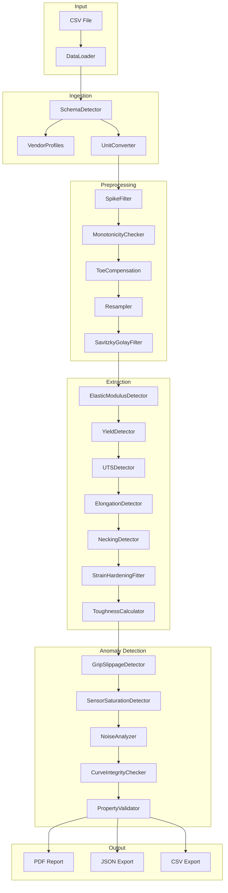

# CurveIntel Architecture

## Overview

CurveIntel is built on a **modular pipeline architecture** where each processing step is an isolated, testable unit. This design enables easy extension (new vendors, new properties, new standards) without touching existing logic.

## System Architecture



## Core Concepts

### AnalysisContext

Every analysis begins with an `AnalysisContext` object that flows through the pipeline. It accumulates:

- **Raw data** — Original stress-strain arrays
- **Processed data** — Filtered, resampled, corrected arrays
- **Properties** — Calculated mechanical properties (E, Rp0.2, Rm, etc.)
- **Anomalies** — Detected issues with severity levels
- **Pipeline log** — Timestamped record of every step
- **Quality score** — Aggregated reliability grade (A+ to D)

### PipelineStep (ABC)

Each step inherits from `PipelineStep` and implements:

```python
class PipelineStep(ABC):
    @abstractmethod
    def process(self, ctx: AnalysisContext) -> AnalysisContext:
        """Transform context and return it."""
        ...
```

This ensures:
- **Single responsibility** — Each step does one thing
- **Testability** — Each step can be tested in isolation
- **Extensibility** — New steps plug in without modifying others
- **Auditability** — Pipeline log records every transformation

## Module Map

| Module | File | Responsibility |
|--------|------|----------------|
| **Base** | `src/pipeline/base.py` | AnalysisContext, PipelineStep ABC, quality scoring |
| **Ingestion** | `src/pipeline/ingestion.py` | CSV loading, encoding detection, schema matching |
| **Vendor Profiles** | `src/pipeline/vendor_profiles.py` | 8 vendor CSV format definitions |
| **Preprocessing** | `src/pipeline/preprocessing.py` | Filtering, resampling, cyclic detection |
| **Extraction** | `src/pipeline/extraction.py` | 7 mechanical property calculators |
| **Anomaly** | `src/pipeline/anomaly.py` | 5 anomaly detectors |
| **Reporting** | `src/pipeline/reporting.py` | PDF generation (ISO 17025 template) |
| **Batch QC** | `src/pipeline/batch_qc.py` | Statistical analysis, SPC charts |
| **Enums** | `src/models/enums.py` | AnomalyType, StressType, MaterialType |
| **Web** | `web/app.py` | FastAPI endpoints, dashboard UI |

## Key Algorithms

### Elastic Modulus (E)

Two methods available:
1. **OLS** — Ordinary Least Squares on the linear elastic region
2. **RANSAC** — Random Sample Consensus for noisy data with outliers

RANSAC is the default because real-world test data contains grip slippage, toe region artifacts, and sensor noise that corrupt OLS regression.

### Yield Strength (Rp0.2)

ISO 6892-1:2019 offset method:
1. Draw a line parallel to the elastic modulus line, offset by 0.2% strain
2. Find intersection with the stress-strain curve
3. Handle discontinuous yield (ReH/ReL) for low-carbon steels

### Cyclic Data Detection

`MonotonicityChecker` uses a running-maximum drop algorithm:
- Calculates deviation from running maximum stress
- If >5 reversals detected within 1% strain range → flagged as cyclic
- Prevents nonsensical property extraction from fatigue/ratcheting data

## Tech Stack

| Layer | Technology |
|-------|-----------|
| Language | Python 3.10+ |
| Web Framework | FastAPI |
| Numerical | NumPy, SciPy, scikit-learn |
| Visualization | Matplotlib |
| PDF Generation | ReportLab |
| Data Processing | Pandas |
| Containerization | Docker |
| CI/CD | GitHub Actions |
